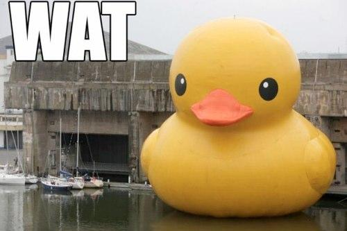

# [fit] Ruby 2.5

---

# About Me

---


^ CTO at Suncoast Developers Guild

---


^ I have promised my girlfriend that I would include a photo of our dog Riley in each presentation I do.

---

# Ruby History

## First release 1995


---

# Ruby History

## 1.8.7 - most of our first encounters

---

# Ruby History

## 1.9 - Significant Changes

- Block local variables
- Stabby lambda!
- New hash style
- Better UTF support

---

# Ruby History

## 1.9 - Slow adoption

---

# Ruby History

## 2.0 MOAR NEW STUFF

- kwarg
- Enumerable lazy (ZOMG)

---

# Ruby History

## 2.1 Speed

---

# Ruby History

## 2.2 Speed and Garbage Collection

^ Symbol GC
^ Incremental GC

---

# Ruby History

## 2.3 Friendlyness

- Frozen strings
- Safe navigation
- #dig
- oh, and performance

---

# Ruby History

## 2.4 Optimization

- Fixnum/Bignum => Integer
- Even moar performance

---

# [fit] Ruby 2.5

# [fit] 20+ new features

### ...that I'll cover...
### ...there are many more...

---

# Many new default gems

```
cmath       gdbm
csv         ipaddr
date        scanf
dbm         sdbm
etc         stringio
fcntl       strscan
fiddle      webrick
fileutils   zlib
```

^ Is this more of a move to gem-ify the stdlib?

^ https://github.com/ruby/ruby/blob/v2_5_0/NEWS

---

# Enumerable#{any?,all?,none?,one?} accept a pattern argument

```ruby
names = %w{Gavin Jason Toni Mark}
# => ["Gavin", "Jason", "Toni"]
names.any?(/i/)
# => true
```

^ https://bugs.ruby-lang.org/issues/11286
^ https://github.com/ruby/ruby/blob/v2_5_1/NEWS`

---


# Integer#allbits?, Integer#anybits?, Integer#nobits?

```ruby
number = 0b101010
# => 42
mask   = 0b101000
# => 40
number.allbits?(mask)
# => true
```

---

# Backward exceptions

- Tired of having to scroll backwards to see where an exception happend?
- Now Ruby will print exceptions in reverse order, but only if output is a TTY
- e.g. so logs by default will retain the original order

---

```ruby
def a
  b
end
def b
  c
end
def c
  d
end
def d
  42/0
end
a
# Traceback (most recent call last):
#         7: from /Users/gstark/.rubies/ruby-2.5.1/bin/irb:11:in `<main>'
#         6: from (irb):59
#         5: from (irb):48:in `a'
#         4: from (irb):51:in `b'
#         3: from (irb):54:in `c'
#         2: from (irb):57:in `d'
#         1: from (irb):57:in `/'
# ZeroDivisionError (divided by 0)
```

---

# Full Error Messages

```ruby
def oopsies
  42 / 0
rescue StandardError => e
  puts "#{e.message} (#{e.class})\n\t#{e.backtrace.join("\n\t")}"
end
oopsies
# divided by 0 (ZeroDivisionError)
# 	(irb):8:in `/'
# 	(irb):8:in `oopsies'
# 	(irb):12:in `irb_binding'
```

^ https://bugs.ruby-lang.org/issues/14141

---

```ruby
def oopsies
  42 / 0
rescue StandardError => e
  puts e.full_message
end
oopsies
# Traceback (most recent call last):
# 	19: from /Users/gstark/.rubies/ruby-2.5.1/bin/irb:11:in `<main>'
# 	18: from /Users/gstark/.rubies/ruby-2.5.1/lib/ruby/2.5.0/irb.rb:383:in `start'
# 	17: from /Users/gstark/.rubies/ruby-2.5.1/lib/ruby/2.5.0/irb.rb:427:in `run'
# 	16: from /Users/gstark/.rubies/ruby-2.5.1/lib/ruby/2.5.0/irb.rb:427:in `catch'
# 	15: from /Users/gstark/.rubies/ruby-2.5.1/lib/ruby/2.5.0/irb.rb:428:in `block in run'
# 	14: from /Users/gstark/.rubies/ruby-2.5.1/lib/ruby/2.5.0/irb.rb:487:in `eval_input'
# 	13: from /Users/gstark/.rubies/ruby-2.5.1/lib/ruby/2.5.0/irb/ruby-lex.rb:231:in `each_top_level_statement'
# 	12: from /Users/gstark/.rubies/ruby-2.5.1/lib/ruby/2.5.0/irb/ruby-lex.rb:231:in `catch'
# 	11: from /Users/gstark/.rubies/ruby-2.5.1/lib/ruby/2.5.0/irb/ruby-lex.rb:232:in `block in each_top_level_statement'
# 	10: from /Users/gstark/.rubies/ruby-2.5.1/lib/ruby/2.5.0/irb/ruby-lex.rb:232:in `loop'
# 	 9: from /Users/gstark/.rubies/ruby-2.5.1/lib/ruby/2.5.0/irb/ruby-lex.rb:246:in `block (2 levels) in each_top_level_statement'
# 	 8: from /Users/gstark/.rubies/ruby-2.5.1/lib/ruby/2.5.0/irb.rb:488:in `block in eval_input'
# 	 7: from /Users/gstark/.rubies/ruby-2.5.1/lib/ruby/2.5.0/irb.rb:623:in `signal_status'
# 	 6: from /Users/gstark/.rubies/ruby-2.5.1/lib/ruby/2.5.0/irb.rb:491:in `block (2 levels) in eval_input'
# 	 5: from /Users/gstark/.rubies/ruby-2.5.1/lib/ruby/2.5.0/irb/context.rb:380:in `evaluate'
# 	 4: from /Users/gstark/.rubies/ruby-2.5.1/lib/ruby/2.5.0/irb/workspace.rb:85:in `evaluate'
# 	 3: from /Users/gstark/.rubies/ruby-2.5.1/lib/ruby/2.5.0/irb/workspace.rb:85:in `eval'
# 	 2: from (irb):18:in `irb_binding'
# 	 1: from (irb):14:in `oopsies'
# (irb):14:in `/': divided by 0 (ZeroDivisionError)
```

---

## rescue / else / ensure can be inside blocks

#### If we wanted to rescue this:

```ruby
[42, 9, 12, 6, 0, 7].each do |number|
  puts "100 divided by #{number} is #{100 / number}"
end
```

#### we'd have to add a `begin / end` block

```ruby
[42, 9, 12, 6, 0, 7].each do |number|
  begin
    puts "100 divided by #{number} is #{100 / number}"
  rescue StandardError => e
    puts "oopsies #{e}"
  end
end
```

^ https://blog.jetbrains.com/ruby/2017/10/10-new-features-in-ruby-2-5/

---

## rescue / else / ensure can be inside blocks

#### But now!

```ruby
[42, 9, 12, 6, 0, 7].each do |number|
  puts "100 divided by #{number} is #{100 / number}"
rescue StandardError => e
  puts "oopsies #{e}"
end
```

---

## Hash transform keys

#### Ever get a hash with keys that are strings but wish they were symbols? (or vice versa?)

```ruby
scores = { "gavin" => 42, "jason" => 98, "toni" => 97, "mark" => 96 }
```

#### Now we can transform the keys

```ruby
scores.transform_keys { |key| key.to_sym }
{:gavin=>42, :jason=>98, :toni=>97, :mark=>96}
```

^ What about key collision

---

# Key collision

```ruby
scores.transform_keys { |key| :oopsies }
# => {:oopsies=>96}
```

---

# Hash Slice

#### Ever just want a hash with *some* of the keys?

```ruby
hash = { name: "Gavin", car: "Tesla", hobby: "Improv", job: "Teaching" }
hash.select { |k,v| [:car, :job].include?(k) }
# => { car: "Tesla", job: "Teaching" }
```

#### Now we can use slice

```ruby
hash.slice(:car, :job)
# => {:car=>"Tesla", :job=>"Teaching"}```
```

---

# String prefix / suffix delete

```ruby

string = "invincible rappers"
string.delete_prefix("in")
# => "vincible rappers"

string = "Ruby is the best language"
string.delete_suffix("language")
# => "Ruby is the best "
```

---

# Array prepend append

#### instead of push and unshift

```
>> names = %w{Gavin}
>> names.unshift("Jason")
# => ["Jason", "Gavin"]
>> names.prepend("Toni")
# => ["Toni", "Jason", "Gavin"]
>> names.push("Mark")
# => ["Toni", "Jason", "Gavin", "Mark"]
>> names.append("Holly")
# => ["Toni", "Jason", "Gavin", "Mark", "Holly"]
```

---

# Integer.sqrt

```
42.sqrt
# => 6
```

---

### `String#each_grapheme_cluster`

```ruby
flags = "🇺🇸🇦🇫"
flags.each_char { |c| puts c }
# => "🇺"
# => "🇸"
# => "🇦"
# => "🇫"

flags.each_grapheme_cluster { |grapheme| puts grapheme }
# => 🇺🇸
# => 🇦🇫
```

---

# Set `to_s`

#### Ruby 2.4

```ruby
require 'set'
names = Set.new(%w{Gavin Jason Toni Mark})
puts names
# => #<Set:0x00007fdff5898bb8>
```

#### Ruby 2.5

```ruby
require 'set'
names = Set.new(%w{Gavin Jason Toni Mark})
puts names
# => #<Set: {"Gavin", "Jason", "Toni", "Mark"}>
```

---

### `Module#{ define_method, alias_method, undef_method, remove_method}`
### now public

-
-
-

#### [fit] Metaprogrammers Rejoice!

---

#### Keyword Structs

```ruby
Dog = Struct.new(:name, :color)
d = Dog.new("Riley", "Brown")
# => #<struct Dog name="Riley", color="Brown">
d.name
# => "Riley"
d.color
# => "Brown"
```

```ruby
Dog = Struct.new(:name, :color, keyword_init: true)
d = Dog.new(color: "Brown", name: "Riley")
# => #<struct Dog name="Riley", color="Brown">
d.name
# => "Riley"
d.color
# => "Brown"
```

^ https://blog.bigbinary.com/2018/01/16/ruby-2-5-allows-creating-structs-with-keyword-arguments.html

---

#### No more top level constant lookup

```ruby
class Swords; end
class Lasers; end
Swords::Lasers
# => (irb):4: warning: toplevel constant Lasers referenced by Swords::Lasers
# => Lasers < Object
```



^ https://blog.jetbrains.com/ruby/2017/10/10-new-features-in-ruby-2-5/

---

#### Ruby 2.5

```ruby
class Swords; end
class Lasers; end
Swords::Lasers
# Traceback (most recent call last):
#         2: from /Users/gstark/.rubies/ruby-2.5.1/bin/irb:11:in `<main>'
#         1: from (irb):3
# NameError (uninitialised constant Swords::Lasers)
# Did you mean?  Lasers
```


---

#### Dir.children

```ruby
Dir.entries(".")
# => [".", "..", "wat.jpg", ".DS_Store", "winning.gif", "riley.png", "1995.jpg", "sdg.svg"]
Dir.entries(".").reject { |entry| entry == "." || entry == ".." }
# => ["wat.jpg", ".DS_Store", "winning.gif", "riley.png", "1995.jpg", "sdg.svg"]
Dir.children(".")
# => ["wat.jpg", ".DS_Store", "winning.gif", "riley.png", "1995.jpg", "sdg.svg"]
```

---

##### Branch Coverage

```
- Ruby now offers branch coverage
- Can tell the difference between a line being evaluated versus a branch being taken
- This would give us 100% coverage since the `guard clause` was *evaluated*
- Branch coverage would tell us that that clause was never tested
```

```ruby
def oopsies(numerator, denominator)
  return :goaway if denominator.zero?

  numerator/denominator
end

assert_equal 2, oopsies(6,3)
```

---

^ `yield self`

---

